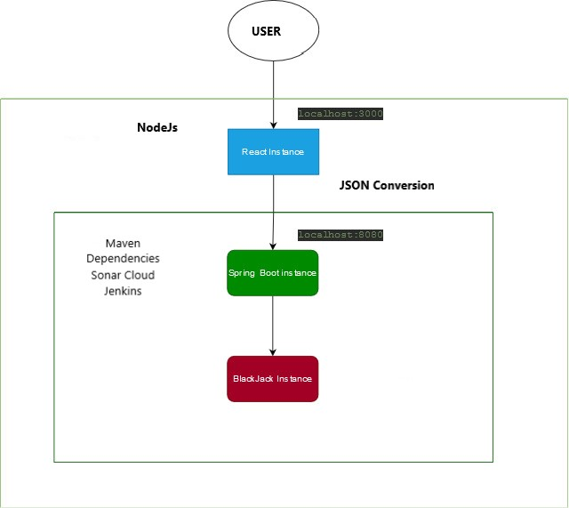
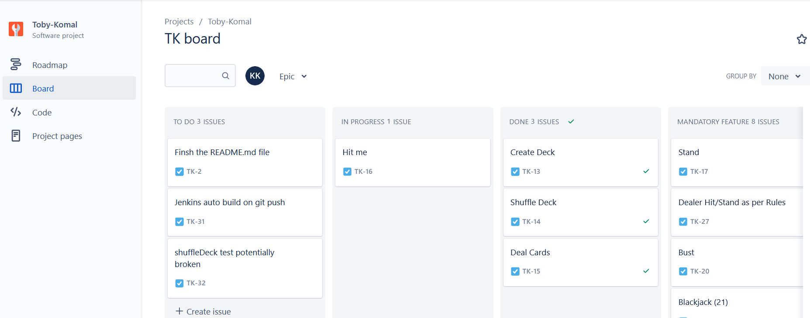
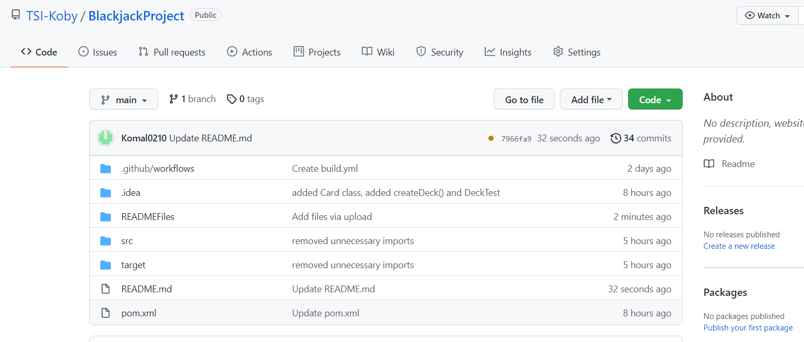
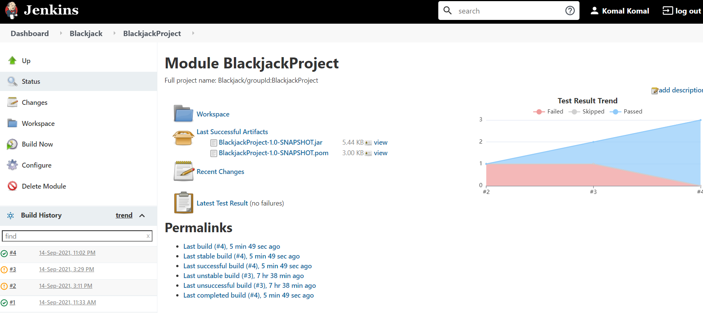
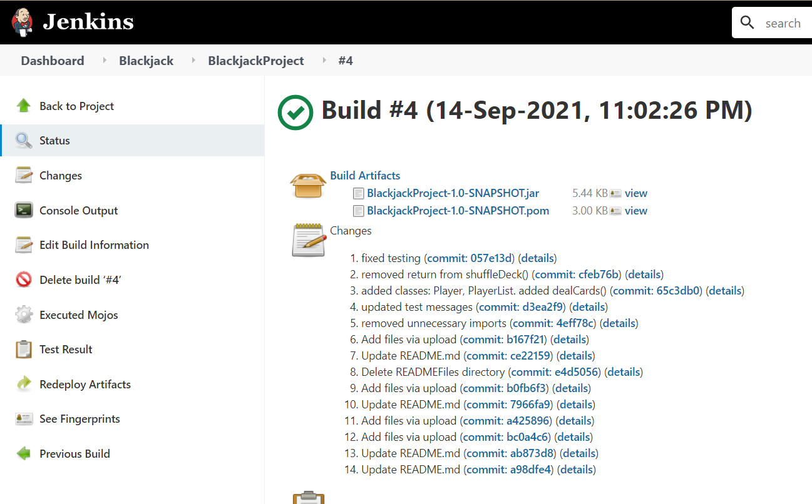
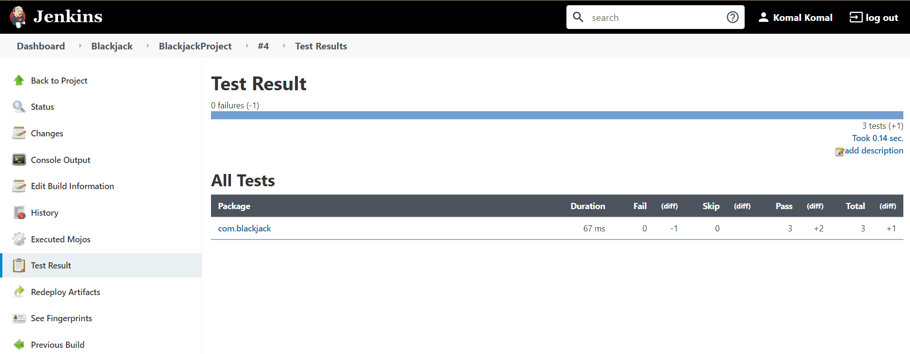

# Blackjack Project
Authors: Toby Whitehead, Komal Komal

Blackjack project with CI pipeline and testing

## Summary

This project focuses on creating a web application of Black Jack 
using Spring boot. React is used for the presentation layer of this 
project.

## Contents

* [Intro](#Blackjack-Project)
* [Architecture](#Architecture)
  * [SpringBoot Setup](#SpringBoot-Setup)
  * [React Setup](#React-Setup)
* [Development Environment](#Development-Environment)
  * [Tools](#Tools)
  * [Kanban Board](#Kanban-Board)
* [CI Pipeline](#CI-Pipeline)
  * [GitHub](#GitHub)
  * [Jenkins](#Jenkins)
* [Testing](#Testing)
* [Future Improvement](#Future-Improvement)

## Architecture
 

 

### SpringBoot Setup

* Go to https://start.spring.io/
* Name the Artifact and give it a suitable name
* Generate the Folder

 

### React Setup

* Go to command line of Windows
* Type the following command:
npm create-react-app BlackjackAppReact

This creates the standard React Service

 

## Development Environment

 

### Kanban Board

Jira is being used for Kanban Board to visualise the work to be done:

 

 

### React Server Setup

* Open command prompt
* Navigate to the project folder
* Run the following code: npm start
 
This should run the server for React App getting accessed by localhost:3000

 

### Spring Boot Server Setup

* Open command prompt
* Navigate to the project folder
* Run the following code: mvn spring-boot: run
  
This should run the server for Spring Boot getting accessed by localhost:8080

 

### Tools

* IntelliJ IDEA 2021.1 Community Edition
* Java 16 for programming the back-end application.
* Git 2.33
* GitHub for cloud-based hosting service, managing Git Repositories
* Apache Maven 3.8.1
* JUnit 5.7.2
* Maven sure-fire plug-in 3.0.0-M5
* Windows 10 as operating System
* SpringBoot for back-end development
* React for front-end development
* Sonar Cloud for checking code smells, security vulnerabilities, and bugs.
* Jira – Kanban Board of choice
* Jacoco 0.8.7 for measuring code coverage in a codebase through visual reports

 

## CI Pipeline

 

### GitHub

GitHub is used as a version control system. It currently only
contains a main branch.

 

 

### Jenkins

 

#### Jenkins Dashboard

 

#### Jenkins Build Run

 

#### Jenkins Test Results

 

### Testing

Some Unit testing is performed here

 

## Future Improvement
<!---
Insert future improvement section
-->
